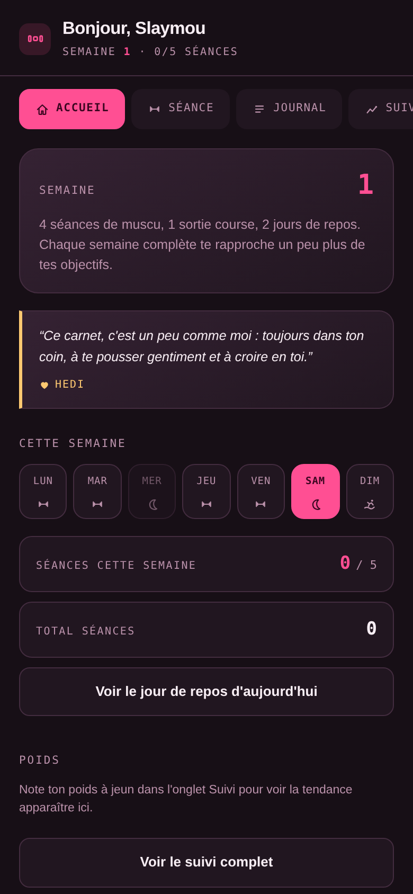
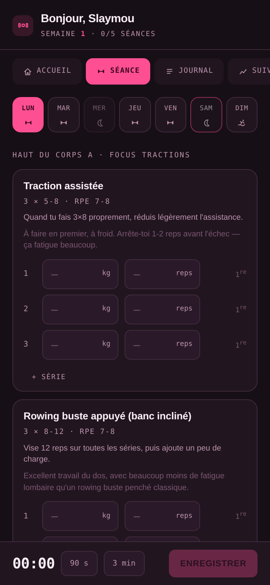
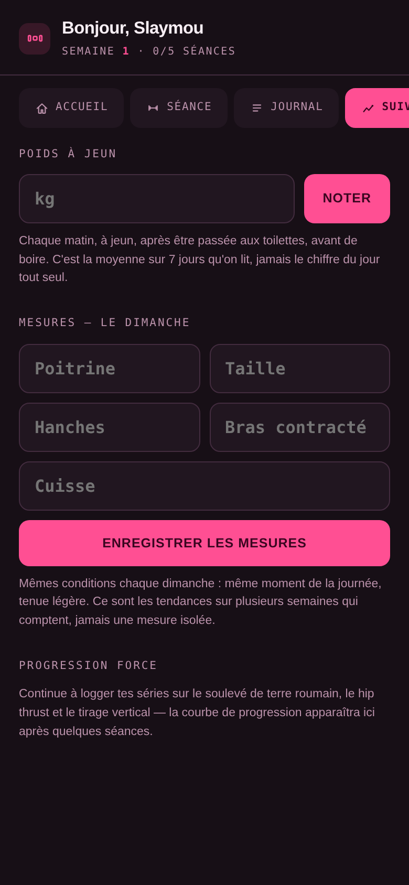

# 🩷 Slaymou — Carnet d'entraînement

Le carnet d'entraînement de Slaymou, personnalisé avec amour à partir de [gym_slaymou](https://github.com/hediiimohamed/gym_slaymou). Une app d'entraînement hors-ligne, en une seule page HTML — pas de compte, pas de serveur, pas de pub. On ouvre et on note ses séries.

<p align="center">
  
  
  
</p>

## Fonctionnalités

- **Semaine réelle (Lun → Dim)** — 4 séances de muscu, 1 sortie course, 2 jours de repos, avec une bande de jours cliquable qui indique le jour actuel et les séances déjà faites.
- **Séance guidée** — séries/reps/RPE pré-remplis selon le programme, tes charges précédentes affichées en repère, notes de progression et de coaching par exercice.
- **Minuteur de repos** — 90 s / 3 min en un tap, intégré à la barre de séance.
- **Check ressenti** — un tap par séance (au top / fatiguée / douleur), avec message adapté si une douleur est signalée.
- **Sortie course** — distance, durée et ressenti, pour suivre la progression du 5 km vers le 10 km.
- **Journal** — historique complet, volume par séance, détail par exercice, suppression en un tap (avec confirmation).
- **Suivi** — poids à jeun (tendance 7 j / 28 j), mesures du corps, et progression de charge sur les mouvements phares.
- **Un petit mot différent chaque jour** — un message écrit par Hedi, qui change chaque jour de l'année.
- **Tes données t'appartiennent** — tout reste en local (`localStorage`). Export JSON à tout moment, réimport possible. Un bouton "tout effacer" protégé par confirmation.
- **Installable** — ajoutable à l'écran d'accueil du téléphone, fonctionne ensuite hors-ligne comme une vraie app.

## Comment chaque séance s'enregistre

Chaque charge et chaque répétition que tu tapes est sauvegardée automatiquement dès que tu l'écris — rien à faire. La séance ne devient une entrée définitive dans ton Journal que lorsque tu appuies sur **Enregistrer**, en bas de l'écran. Tu peux donc fermer l'app en plein milieu d'une séance sans rien perdre.

## Démarrer

Rien à installer, rien à compiler.

- **En local** : ouvre [index.html](index.html) dans un navigateur.
- **Sur le téléphone** : héberge le dossier (par ex. GitHub Pages), ouvre le lien une fois, puis "Ajouter à l'écran d'accueil" — ça fonctionnera ensuite hors-ligne.

```bash
cd slaymou-gym
python3 -m http.server 8000   # ou ouvre index.html directement
```

## Adapter le programme

Tout ce que tu voudras probablement changer se trouve au même endroit : le bloc `CONFIG` tout en haut du `<script>` dans [index.html](index.html).

```js
const PROFILE = {
  name:       "Slaymou",
  start:      "2026-09-19",
  weeklyGoal: 5,
};

const PROGRAM = {
  lun: { label:"Haut du corps A · Focus tractions", type:"training", ex: [
    { id:"pu_assist", n:"Traction assistée", s:3, r:"5-8", rpe:"7-8", tip:"...", coach:"..." },
    // ...
  ]},
  // mar, mer (repos), jeu, ven, sam (repos), dim (course)...
};
```

- Ajoute/retire des exercices dans les tableaux `ex` — chaque exercice a besoin d'un `id` unique et **stable** (il sert de clé d'historique ; le changer efface l'historique de cet exercice).
- `s` = séries, `r` = fourchette de répétitions, `rpe` = intensité perçue visée, `tip` = comment progresser, `coach` = note technique, `caution:true` = met la note en évidence (sécurité).
- Les mots doux du bas de l'accueil se trouvent dans `LOVE_NOTES` — à toi de les changer, d'en ajouter, de les rendre encore plus toi.
- Le reste du fichier est la mécanique de l'app, pas besoin d'y toucher.

## Structure du projet

```
slaymou-gym/
├── index.html          # toute l'app : structure, styles, logique
├── manifest.json        # manifeste PWA (installable, icône d'accueil)
├── icons/                # favicon + icônes de l'app
└── docs/screenshots/     # images utilisées dans ce README
```

## Tech

HTML/CSS/JS pur. Aucun framework, aucune dépendance, aucun outil de build — toute l'app tient dans un seul fichier, facile à lire et à adapter.

## Vie privée et données

Toutes les données restent sur l'appareil, dans `localStorage`. Rien n'est envoyé nulle part. Utilise le bouton **Exporter** de l'onglet Données régulièrement pour sauvegarder l'historique en JSON — vider les données du navigateur l'effacerait sinon.

## Avertissement

Les notes de sécurité (comme celle sur l'extension lombaire) sont des repères personnels, pas un avis médical. En cas de douleur persistante, consulte un professionnel de santé.

## Une dernière chose

Cette app n'est pas juste un outil. C'est une manière pour Hedi de te dire qu'il croit en toi, un peu chaque jour. 🩷
